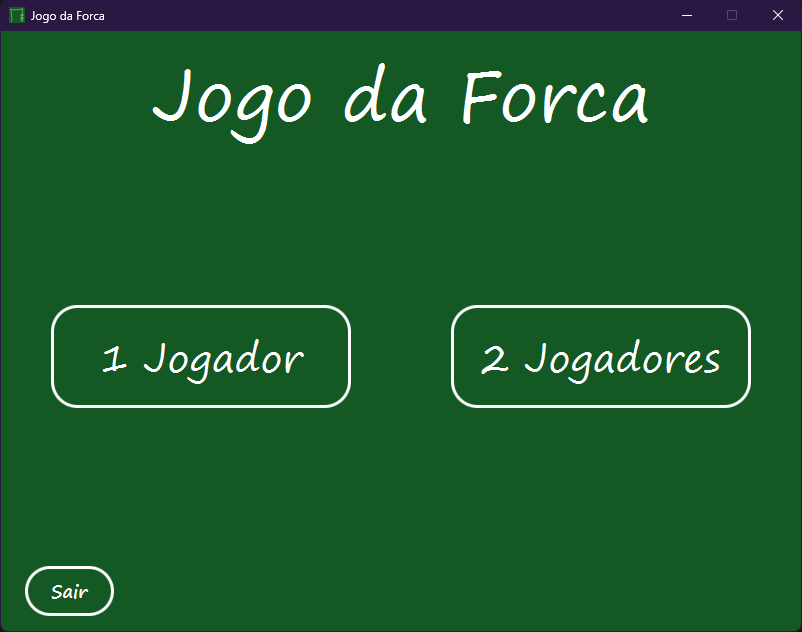
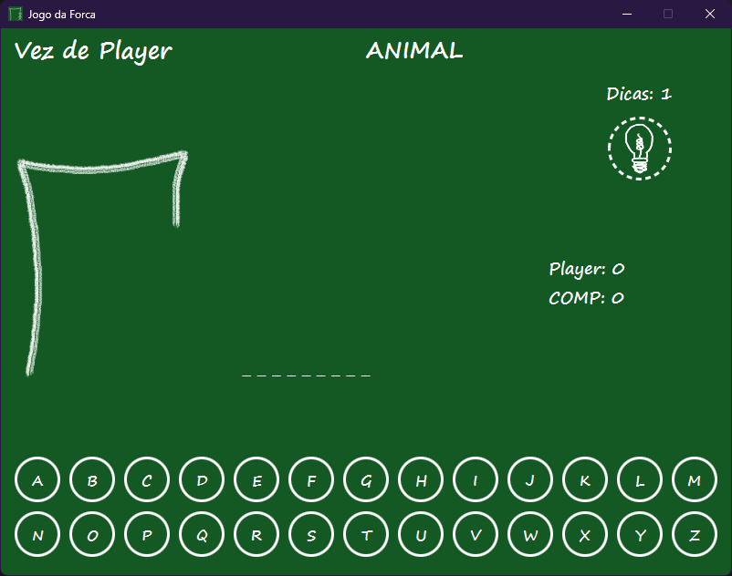
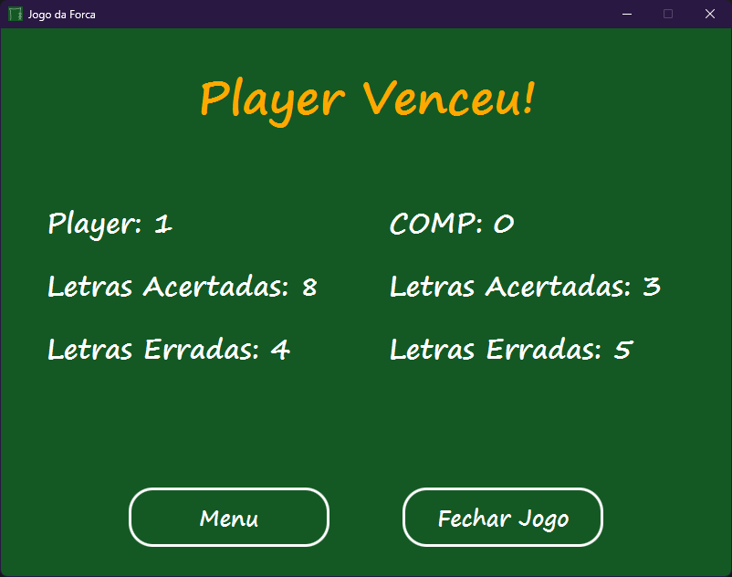

# 🎮 Jogo da Forca (JavaFX)

Um jogo da forca moderno e interativo desenvolvido como projeto final de uma disciplina da faculdade. O projeto utiliza **JavaFX** para a interface gráfica e segue estritamente o padrão de arquitetura **MVC (Model-View-Controller)**.


## 📸 Screenshots
<div align="center">
  
  
  
</div>

## ✨ Funcionalidades

* **Modo Multiplayer:** Dois jogadores locais alternam turnos.
* **Modo Vs Computador:** Jogue contra um *bot*.
* **Categorias:** Banco de palavras dinâmico (Frutas, Países, Animais, etc.).
* **Interface Rica:** Animações, dicas visuais e *feedback* imediato.
* **Tratamento de Erros:** Sistema robusto contra falhas de arquivos ou lógica.

## 🛠️ Tecnologias Utilizadas

* **Java 24** (Linguagem Core)
* **JavaFX 22** (Interface Gráfica)
* **Maven** (Gerenciamento de Dependências)
* **CSS** (Estilização da Interface)
* **jpackage** (Criação do Instalador)

## 🚀 Como Rodar o Projeto

### Opção 1: Instalador (Usuário Final)
Baixe a versão mais recente na aba [Releases](https://github.com/KawanMonteiro/JogoForca/releases/tag/v1.0.0) e instale no Windows.

### Opção 2: Via Código (Desenvolvedores)
Pré-requisitos: Java JDK 17+ instalado.

Clone o repositório:
   ```bash
   git clone https://github.com/KawanMonteiro/JogoForca.git 
   ```

## 🧩 Estrutura do Projeto (MVC)
O código foi organizado para garantir a separação de responsabilidades:

* **Model**: MotorDeJogo, Palavra, Partida (Regras de negócio e estado).
* **View**: Arquivos .fxml e CSS (Aparência).
* **Controller**: JogoController, MenuController (Gerencia a interação entre a tela e o motor).

## 👨‍💻 Autor
**[Kawan Monteiro](https://github.com/KawanMonteiro)**